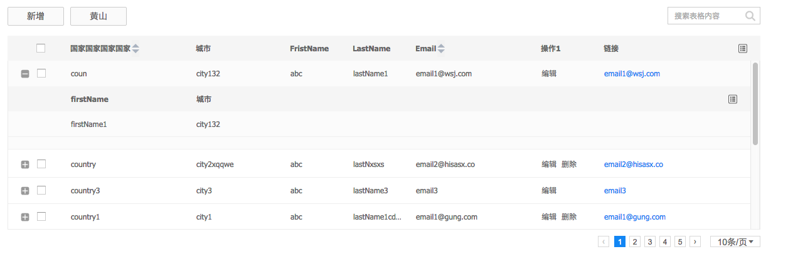

# uxcore-table

---

Table UI Component based on React. working for many modes such as sub table, tree table and inline editing table.




## How to run

```sh
$ git clone https://github.com/uxcore/uxcore-table
$ cd uxcore-table
$ npm install
$ gulp server
```

## Best Practice

```javascript

	let columns = [
        { dataKey: 'check', type: 'checkbox', disable: false}, // custom checkbox column, dataKey can be anyone, true means checked.
	    { dataKey: 'id', title: 'ID', width: 50,hidden:true},
	    { dataKey: 'country', title:'国家', width: 200,ordered:true},
	    { dataKey: 'city',title:'城市', width: 150,ordered:true },
	    { dataKey: 'firstName',title:"FristName" },  
	    { dataKey: 'lastName' ,title:"LastName"},
	    { dataKey: 'email',title:"Email",width: 200,ordered:true }
	];


	let rowSelection = {
      onSelect: function(record, selected, selectedRows) {
        console.log(record, selected, selectedRows);
      },
      onSelectAll: function(record, data) {
        console.log(record, data);
      }
    };

	renderProps={
        actionBar: {
           'new': function(type, actions){ alert(type); },  // type means 'new' in this line
           'import': function(type, actions){ alert(type); }, // actions contains all table's APIs, such as actions.addEmptyRow()
           'export': function(type, actions){ alert(type); }
        },
        fetchUrl:"http://localhost:3000/demo/data.json",
        jsxcolumns:columns,
        subComp:(<Table {...renderSubProps}  ref="subTable"/>),
        rowSelection: rowSelection
	},
	
	renderSubProps={
        jsxcolumns:columns,
        fetchUrl:"http://localhost:3000/demo/data.json",
        queryKeys:["dataKey","firstName"],
        onModifyRow: this.onModifyRow
	};

	<Table {...renderProps} />

```


## Props

|Name             |Type                |Require   |Default |Note |
|---              |---                 |---       |---     |---|
|jsxcolumns       |array               |required  |null    |表格列配置项，具体见[这里](#jsxcolumns)|
|width            |number              |optional  |1000    |表格的宽度|
|height           |number              |optional  |100%    |表格的高度|
|showColumnPicker |boolean             |optional  |true    |是否显示列筛选按钮|
|showPager        |boolean             |optional  |true    |是否显示分页|
|showHeader       |boolean             |optional  |true    |是否显示表格头部|
|showMask         |boolean             |optional  |true    |是否在 loading 的时候显示蒙层|
|showSearch       |boolean             |optional  |false   |是否显示内置的搜索栏| 
|doubleClickToEdit|boolean             |optional  |true    |是否开启双击编辑|
|emptyText        |string or element   |optional  |"暂无数据"|
|headerHeight     |number              |optional  |40      |表格头部的高度|
|pageSize         |number              |optional  |10      |每页显示多少条数据|
|queryKeys        |array               |optional  |[]      |有哪些数据会传递给 subComp|
|jsxdata          |object              |optional  |-       |在远端数据还没有返回时用作默认数据|
|fetchUrl         |string              |optional  |""      |表格的数据源|
|fetchParams      |object              |optional  |-       |表格在请求数据时，会额外附带的参数，具有最高的优先级|
|actionBar        |object/array        |optional  |null    |表格内置的操作条配置，详细[见此](#actionbar)|
|beforeFetch      |function(data, from)|optional  |noop    |两个参数，data 表示表格请求数据时即将发送的参数，from 表示这次请求数据的行为从哪里产生，内置的有 `search`(搜索栏),`order`(排序) & `pagination`(分页)，该函数需要返回值，返回值为真正请求所携带的参数。|
|processData      |function(data)      |optional  |noop    |有时源返回的数据格式，并不符合 Table 的要求，可以通过此函数进行调整，参数 data 是返回数据中 content 字段的 value，该函数需要返回值，返回值为符合 content 字段 value 的数据结构。|
|addRowClassName  |function(rowData)   |optional  |noop    |用于为特定的某几行添加特殊的 class，用于样式定制|


### 折叠展开专用
|Name            |Type                |Require   |Default|Note |
|---             |---                 |---       |---    |---|
|SubComp         |React Element       |optional  | -     |传入二级组件|


### Tree 模式专用

|Name            |Type                |Require   |Default|Note |
|---             |---                 |---       |---    |---|
|renderModel     |string              |optional  |''     |使用 tree 模式时，此项为 'tree'|
|levels          |number              |optional  |1      |tree 模式默认展开的级数|

### 行内编辑表格专用

|Name            |Type                |Require   |Default|Note |
|---             |---                 |---       |---    |---|
|onChange        |function(data)      |optional  |noop   |有表格编辑行为触发，参数的数据格式为 {data: 表格的所有数据, changedData: 变动行的数据, dataKey: xxx, editKey: xxx, pass: 正在编辑的域是否通过校验} |
|getSavedData    |boolean             |optional  |true   |onChange 中的数据是否是保存之后的数据(通过了 saveRow() 的数据)|


### 列配置项(jsxcolumns)

|Key Name        |Type            |Require  |Note   | 
|-----------     |----------      |------   |-----  |
|dataKey         |string          |required |表格的数据中用于查看模式展示的字段|
|editKey         |string          |optional |表格的数据中用于编辑模式的字段，如对于 select 来说，此项应为选项里的 key| 
|title           |string          |required |列头|
|width           |number          |required |列宽|
|hidden          |boolean         |optional |是否隐藏，默认为 false|
|order           |boolean         |optional |是否显示内置的排序，默认为 false|
|type            |string          |optional |包含 'money', 'card', 'cnmobile', 'checkbox', 'action', 'radio', 'text', 'select' 和 'custom'|
|actions         |array           |optional |当 type 是 action 的时候会用到，用于定义具体有哪些操作，格式见下方[说明](#actions)|
|customField     |React Element   |optional |当 type 是 custom 的时候会用到，用于传入自定义的 Field，用于行内编辑|
|render          |function        |optional |在查看模式下，用户定制渲染的方式，返回一个 jsx 格式|
|fixed           |boolean         |optional |是否为固定列|
|delimiter       |string          |optional |在 type 是 'money', 'card', 'cnmobile' 的时候会用到，用于传入格式化的分隔符|
|align           |string          |optional |文字居中方式，默认 'left'|
 


### 列配置项的例子
```javascript

let columns = [
        { dataKey: 'check', type: 'checkbox', disable: false}, // custom checkbox column, dataKey can be anyone, true means checked.
        { dataKey: 'country', title:'国家', width: 200,ordered:true},
        { dataKey: 'city',title:'城市', width: 150,ordered:true },
        { dataKey: 'firstName',title:"FristName" },  
        { dataKey: 'lastName' ,title:"LastName"},
        { dataKey: 'email',title:"Email",width: 200, ordered:true },
        { dataKey: 'action1', title:'操作1', width:100, type:"action",actions: [
            {
                title: '编辑',
                callback: (rowData) => {
                    me.refs.grid.editRow(rowData);
                },
                mode: Constants.MODE.VIEW
            },
            {
                title: '保存',
                callback: (rowData) => {
                    me.refs.grid.saveRow(rowData);
                },
                mode: Constants.MODE.EDIT
            }
        ]},
        { dataKey: 'action', title:'链接', width:100, render: function(cellData,rowData) {
            return <div><a href="#">{rowData.email}</a></div>
        }}
 ]

```


## 返回的数据格式

* 数据格式的约定[见此](http://gitlab.alibaba-inc.com/alinw/yosemite/issues/18) 

```javascript
   {
	"content":{
		"data":[
			{	
				"id":'1'
				"grade":"grade1",
				"email":"email1",
				"firstName":"firstName1",
				"lastName":"lastName1",
				"birthDate":"birthDate1",
				"country":"country1",
				"city":"city1"
			}
			...
	
		],
		"currentPage":1,
		"totalCount":30
	},
	"success": true,
	"errorCode": "",
	"errorMsg": ""
	}

```

> 上面的数据格式是 ajax 返回的数据格式要求，如果你通过 jsxdata 传值，只需要 content 里面的内容。

```javascript
{
    "data":[
        {   
            "id":'1'
            "grade":"grade1",
            "email":"email1",
            "firstName":"firstName1",
            "lastName":"lastName1",
            "birthDate":"birthDate1",
            "country":"country1",
            "city":"city1"
        }
        ...

    ],
    "currentPage":1,
    "totalCount":30
}
```

### ActionBar 配置的例子

```javascript

// actionBar 支持传入一个对象
actionBar: {
    "新增行": () => { // 点击回调
        me.refs.grid.addEmptyRow();
    },
    "编辑所有行": () => {
        me.refs.grid.editAllRow();
    }
}

// 或者定制能力更加强大的数组
actionBar: [
    {
        title: '新增行', // 显示名称
        callback: () => { // 点击回调
            me.refs.grid.addEmptyRow();
        },
        render: (title) => { // 定制渲染
            return <Button>{title}</Button>
        }
    },
    {
        title: "编辑所有行",
        callback: () => {
            me.refs.grid.editAllRow();
        }
    },
    {
        title: "保存所有行",
        callback: () => {
            me.refs.grid.saveAllRow();
        }
    }
    
]
```


### actions 配置的例子

```javascript
actions: [
    {
        title: '编辑', // 操作名称
        callback: (rowData) => { // 操作回调
            me.refs.grid.editRow(rowData);
        },
        mode: Constants.MODE.VIEW // 非必要参数，只在何种模式下显示
    },
    {
        title: '保存',
        callback: (rowData) => {
            me.refs.grid.saveRow(rowData);
        },
        mode: Constants.MODE.EDIT,
        render: (title) => { // 定制渲染
            return title + '1'
        }
    }
]
```

## API

### 行内编辑用 

* getData(): 返回表格的数据，并作校验。
* addEmptyRow(): 添加一个空的新行。
* addRow(rowData): 以指定数据添加一个新行。
* delRow(rowData): 删除一个新行。
* editRow(rowData): 使指定的行切换到编辑模式。
* viewRow(rowData): 使指定的行切换到查看模式。
* saveRow(rowData): 保存行的数据(同时切换至查看模式)。
* resetRow(rowData): 重置行到数据（若保存过，则为保存过后的数据）。

### 获取数据

* fetchData(from): 使表格重新请求一次数据。
    * @param from {string} {optional}: 这个参数会传入到 beforeFetch 的回调中。

### 其他

* toggleSubComp(rowData): 使指定的行显示或隐藏二级组件(subComp)。